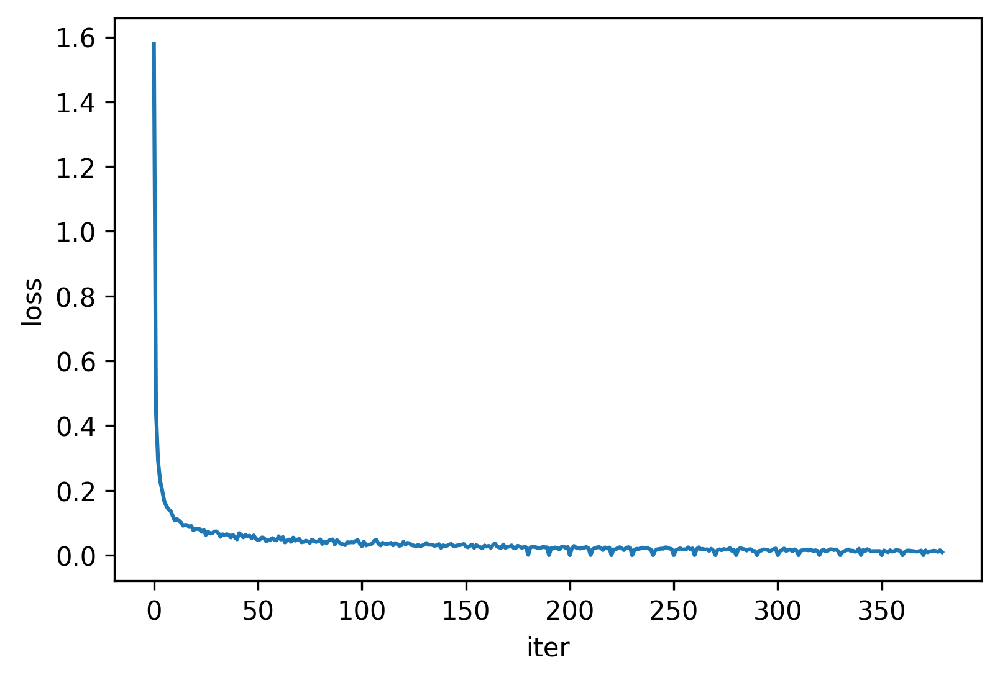
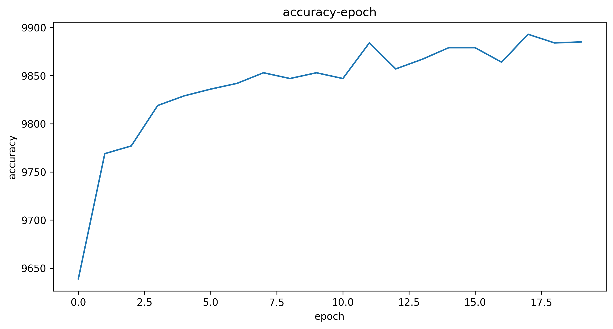
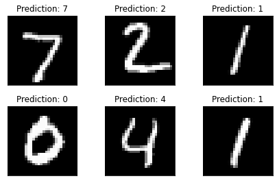

### 导入数据


```python
import torchvision
import torch
from torch.utils.data import DataLoader
import torch.nn.functional as F
import matplotlib.pyplot as plt
train_data = torchvision.datasets.MNIST(root="./data",train=True,download=False)
test_data = torchvision.datasets.MNIST(root="./data",train=False,download=False)

train_data[50][0]
```

    /home/melancholycy/SoftWare/miniconda3/envs/pytorch/lib/python3.9/site-packages/tqdm/auto.py:22: TqdmWarning: IProgress not found. Please update jupyter and ipywidgets. See https://ipywidgets.readthedocs.io/en/stable/user_install.html
      from .autonotebook import tqdm as notebook_tqdm


    

    


### img转换为tensor


```python
# 数据集载入
train_data = torchvision.datasets.MNIST(root="./data",train=True,transform=torchvision.transforms.ToTensor(),download=False)
test_data = torchvision.datasets.MNIST(root="./data",train=False,transform=torchvision.transforms.ToTensor(),download=False)
train_loader = DataLoader(train_data,batch_size=32,shuffle=True)
test_loader = DataLoader(test_data,batch_size=32,shuffle=False)
```

### CNN网络层


```python
class Net(torch.nn.Module):
    def __init__(self):
        super(Net,self).__init__()
        self.con1 = torch.nn.Conv2d(1,10,kernel_size=5)  # 卷积层1
        self.con2 = torch.nn.Conv2d(10,20,kernel_size=5) # 卷积层2
        self.pooling = torch.nn.MaxPool2d(2) # 池化层
        self.fc = torch.nn.Linear(320,10)  # 全链接层
    
    # 前向传播
    def forward(self,x):
        batch_size = x.size(0)
        x = F.relu(self.pooling(self.con1(x))) # 卷积1 + 池化
        x = F.relu(self.pooling(self.con2(x))) # 卷积2 + 池化
        x = x.view(batch_size,-1)  # 铺平
        x = self.fc(x) # 全链接层
        return x
#模型实例化        
model = Net()

device = torch.device("cuda:0" if torch.cuda.is_available() else "cpu")
model.to(device)

```


    Net(
      (con1): Conv2d(1, 10, kernel_size=(5, 5), stride=(1, 1))
      (con2): Conv2d(10, 20, kernel_size=(5, 5), stride=(1, 1))
      (pooling): MaxPool2d(kernel_size=2, stride=2, padding=0, dilation=1, ceil_mode=False)
      (fc): Linear(in_features=320, out_features=10, bias=True)
    )


### 定义损失函数交叉熵和优化其SGD


```python
# lossfunction 损失函数使用交叉熵作为评判标准
lossfun = torch.nn.CrossEntropyLoss()

# 随机梯度下降
opt = torch.optim.SGD(model.parameters(),lr=0.01,momentum=0.5)

loss_all = []
```

### 训练函数，卷积，每隔200个数据记录一次loss


```python
def train(epoch): # 训练模型
    running_loss = 0.0
    for i,(inputs,targets) in enumerate(train_loader,0):
        inputs,targets = inputs.to(device),targets.to(device) # to gpu
        opt.zero_grad() #清空 grad数据
        outputs = model(inputs) # 神经网络
        loss = lossfun(outputs,targets) # 求解loss
        loss.backward() # loss反向传播损失
        opt.step() # SGD---梯度下降
        running_loss += loss.item()
        if i % 200 == 0:
            loss_all.append(running_loss/200)
            print('[epoch:%d，%d] loss:%.3f' % (epoch+1,i+1,running_loss/200)) #打印训练过程
            running_loss = 0.0

```


```python
accuracy = []
def test():
    total = 0
    correct = 0
    with torch.no_grad(): # 关闭梯度下降
        for (inputs,targets) in test_loader:
            # to GPU
            inputs, targets = inputs.to(device), targets.to(device)
            # pred
            outputs = model(inputs)
            _,predicted = torch.max(outputs.data,dim=1)
            total += targets.size(0)
            correct += (predicted == targets).sum().item()
    accuracy.append(correct)
    print(100*correct/total)

```


```python
if __name__ == '__main__':
    for epoch in range(20):
        train(epoch)
        test()

```

    [epoch:1，1] loss:0.001
    [epoch:1，201] loss:0.024
    [epoch:1，401] loss:0.026
    [epoch:1，601] loss:0.026
    [epoch:1，801] loss:0.023
    [epoch:1，1001] loss:0.021
    [epoch:1，1201] loss:0.023
    [epoch:1，1401] loss:0.025
    [epoch:1，1601] loss:0.024
    [epoch:1，1801] loss:0.024
    98.89
    [epoch:2，1] loss:0.000
    [epoch:2，201] loss:0.022
    [epoch:2，401] loss:0.021
    [epoch:2，601] loss:0.024
    [epoch:2，801] loss:0.022
    [epoch:2，1001] loss:0.017
    [epoch:2，1201] loss:0.025
    [epoch:2，1401] loss:0.027
    [epoch:2，1601] loss:0.022
    [epoch:2，1801] loss:0.025
    98.95
    [epoch:3，1] loss:0.000
    [epoch:3，201] loss:0.021
    [epoch:3，401] loss:0.028
    [epoch:3，601] loss:0.023
    [epoch:3，801] loss:0.022
    [epoch:3，1001] loss:0.020
    [epoch:3，1201] loss:0.022
    [epoch:3，1401] loss:0.023
    [epoch:3，1601] loss:0.025
    [epoch:3，1801] loss:0.021
    98.83
    [epoch:4，1] loss:0.000
    [epoch:4，201] loss:0.019
    [epoch:4，401] loss:0.022
    [epoch:4，601] loss:0.024
    [epoch:4，801] loss:0.025
    [epoch:4，1001] loss:0.022
    [epoch:4，1201] loss:0.016
    [epoch:4，1401] loss:0.024
    [epoch:4，1601] loss:0.021
    [epoch:4，1801] loss:0.024
    98.83
    [epoch:5，1] loss:0.000
    [epoch:5，201] loss:0.018
    [epoch:5，401] loss:0.017
    [epoch:5，601] loss:0.022
    [epoch:5，801] loss:0.024
    [epoch:5，1001] loss:0.021
    [epoch:5，1201] loss:0.016
    [epoch:5，1401] loss:0.022
    [epoch:5，1601] loss:0.024
    [epoch:5，1801] loss:0.023
    98.93
    [epoch:6，1] loss:0.000
    [epoch:6，201] loss:0.015
    [epoch:6，401] loss:0.019
    [epoch:6，601] loss:0.019
    [epoch:6，801] loss:0.021
    [epoch:6，1001] loss:0.023
    [epoch:6，1201] loss:0.022
    [epoch:6，1401] loss:0.023
    [epoch:6，1601] loss:0.020
    [epoch:6，1801] loss:0.017
    98.72
    [epoch:7，1] loss:0.000
    [epoch:7，201] loss:0.014
    [epoch:7，401] loss:0.018
    [epoch:7，601] loss:0.019
    [epoch:7，801] loss:0.020
    [epoch:7，1001] loss:0.020
    [epoch:7，1201] loss:0.024
    [epoch:7，1401] loss:0.023
    [epoch:7，1601] loss:0.020
    [epoch:7，1801] loss:0.019
    98.89
    [epoch:8，1] loss:0.000
    [epoch:8，201] loss:0.015
    [epoch:8，401] loss:0.018
    [epoch:8，601] loss:0.021
    [epoch:8，801] loss:0.017
    [epoch:8，1001] loss:0.018
    [epoch:8，1201] loss:0.018
    [epoch:8，1401] loss:0.024
    [epoch:8，1601] loss:0.018
    [epoch:8，1801] loss:0.021
    98.74
    [epoch:9，1] loss:0.000
    [epoch:9，201] loss:0.019
    [epoch:9，401] loss:0.024
    [epoch:9，601] loss:0.018
    [epoch:9，801] loss:0.019
    [epoch:9，1001] loss:0.017
    [epoch:9，1201] loss:0.018
    [epoch:9，1401] loss:0.013
    [epoch:9，1601] loss:0.020
    [epoch:9，1801] loss:0.014
    98.84
    [epoch:10，1] loss:0.000
    [epoch:10，201] loss:0.016
    [epoch:10，401] loss:0.018
    [epoch:10，601] loss:0.015
    [epoch:10，801] loss:0.019
    [epoch:10，1001] loss:0.017
    [epoch:10，1201] loss:0.018
    [epoch:10，1401] loss:0.022
    [epoch:10，1601] loss:0.013
    [epoch:10，1801] loss:0.016
    98.8
    [epoch:11，1] loss:0.000
    [epoch:11，201] loss:0.018
    [epoch:11，401] loss:0.022
    [epoch:11，601] loss:0.019
    [epoch:11，801] loss:0.018
    [epoch:11，1001] loss:0.014
    [epoch:11，1201] loss:0.018
    [epoch:11，1401] loss:0.018
    [epoch:11，1601] loss:0.012
    [epoch:11，1801] loss:0.013
    99.01
    [epoch:12，1] loss:0.000
    [epoch:12，201] loss:0.013
    [epoch:12，401] loss:0.014
    [epoch:12，601] loss:0.018
    [epoch:12，801] loss:0.017
    [epoch:12，1001] loss:0.016
    [epoch:12，1201] loss:0.012
    [epoch:12，1401] loss:0.015
    [epoch:12，1601] loss:0.019
    [epoch:12，1801] loss:0.020
    98.84
    [epoch:13，1] loss:0.000
    [epoch:13，201] loss:0.013
    [epoch:13，401] loss:0.015
    [epoch:13，601] loss:0.020
    [epoch:13，801] loss:0.013
    [epoch:13，1001] loss:0.016
    [epoch:13，1201] loss:0.018
    [epoch:13，1401] loss:0.012
    [epoch:13，1601] loss:0.018
    [epoch:13，1801] loss:0.014
    98.59
    [epoch:14，1] loss:0.000
    [epoch:14，201] loss:0.014
    [epoch:14，401] loss:0.015
    [epoch:14，601] loss:0.016
    [epoch:14，801] loss:0.015
    [epoch:14，1001] loss:0.015
    [epoch:14，1201] loss:0.017
    [epoch:14，1401] loss:0.012
    [epoch:14，1601] loss:0.015
    [epoch:14，1801] loss:0.013
    98.89
    [epoch:15，1] loss:0.000
    [epoch:15，201] loss:0.014
    [epoch:15，401] loss:0.017
    [epoch:15，601] loss:0.012
    [epoch:15，801] loss:0.013
    [epoch:15，1001] loss:0.018
    [epoch:15，1201] loss:0.018
    [epoch:15，1401] loss:0.016
    [epoch:15，1601] loss:0.017
    [epoch:15，1801] loss:0.013
    99.0
    [epoch:16，1] loss:0.000
    [epoch:16，201] loss:0.009
    [epoch:16，401] loss:0.013
    [epoch:16，601] loss:0.015
    [epoch:16，801] loss:0.018
    [epoch:16，1001] loss:0.013
    [epoch:16，1201] loss:0.014
    [epoch:16，1401] loss:0.011
    [epoch:16，1601] loss:0.012
    [epoch:16，1801] loss:0.020
    98.93
    [epoch:17，1] loss:0.000
    [epoch:17，201] loss:0.016
    [epoch:17，401] loss:0.012
    [epoch:17，601] loss:0.018
    [epoch:17，801] loss:0.015
    [epoch:17，1001] loss:0.012
    [epoch:17，1201] loss:0.013
    [epoch:17，1401] loss:0.012
    [epoch:17，1601] loss:0.013
    [epoch:17，1801] loss:0.013
    98.89
    [epoch:18，1] loss:0.000
    [epoch:18，201] loss:0.015
    [epoch:18，401] loss:0.011
    [epoch:18，601] loss:0.009
    [epoch:18，801] loss:0.015
    [epoch:18，1001] loss:0.011
    [epoch:18，1201] loss:0.013
    [epoch:18，1401] loss:0.016
    [epoch:18，1601] loss:0.014
    [epoch:18，1801] loss:0.013
    98.99
    [epoch:19，1] loss:0.000
    [epoch:19，201] loss:0.010
    [epoch:19，401] loss:0.014
    [epoch:19，601] loss:0.014
    [epoch:19，801] loss:0.013
    [epoch:19，1001] loss:0.013
    [epoch:19，1201] loss:0.011
    [epoch:19，1401] loss:0.011
    [epoch:19，1601] loss:0.012
    [epoch:19，1801] loss:0.014
    98.89
    [epoch:20，1] loss:0.000
    [epoch:20，201] loss:0.015
    [epoch:20，401] loss:0.009
    [epoch:20，601] loss:0.012
    [epoch:20，801] loss:0.012
    [epoch:20，1001] loss:0.014
    [epoch:20，1201] loss:0.013
    [epoch:20，1401] loss:0.010
    [epoch:20，1601] loss:0.015
    [epoch:20，1801] loss:0.009
    99.02


### 打印loss


```python
# plot loss
x = [i for i in range(len(loss_all))]
fig = plt.figure(dpi=300)
plt.plot(x,loss_all)
plt.xlabel("iter")
plt.ylabel("loss")
plt.show()
```


    

    


### 打印test accuracy


```python
# plot accuracy 
y = [i for i in range(len(accuracy))]
fig = plt.figure(figsize =(10,5),dpi=300)
for i in accuracy:
    i/=100
plt.plot(y,accuracy)
plt.xlabel("epoch")
plt.ylabel("accuracy")
plt.title("accuracy-epoch")
plt.show()
```


    

    


```python

```

### 预测及可视化参照


```python
count = 10
with torch.no_grad(): # 关闭梯度下降
    for (inputs,targets) in test_loader:
        # to GPU
        inputs, targets = inputs.to(device), targets.to(device)
        # pred
        outputs = model(inputs)
        _,predicted = torch.max(outputs.data,dim=1)
        for i in range(6):
            plt.subplot(2,3,i+1)
            plt.tight_layout()
            plt.imshow(test_data[i][0],cmap="gray",interpolation='none')
            plt.title("Prediction: {}".format(predicted[i]))
            plt.xticks([])
            plt.yticks([])
        break
        
```


    

    


```python

```
